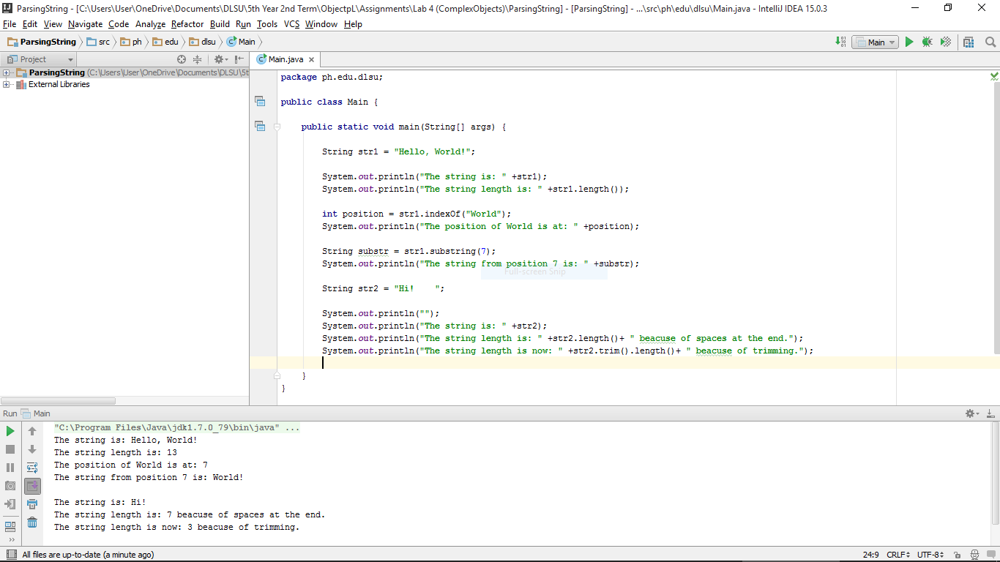

#ParsingString

Getting of string length and string position, and trimming of strings.

#ScreenShot

#Code

~~~
package ph.edu.dlsu;

public class Main {

    public static void main(String[] args) {

        String str1 = "Hello, World!";

        System.out.println("The string is: " +str1);
        System.out.println("The string length is: " +str1.length());

        int position = str1.indexOf("World");
        System.out.println("The position of World is at: " +position);

        String substr = str1.substring(7);
        System.out.println("The string from position 7 is: " +substr);

        String str2 = "Hi!    ";

        System.out.println("");
        System.out.println("The string is: " +str2);
        System.out.println("The string length is: " +str2.length()+ " beacuse of spaces at the end.");
        System.out.println("The string length is now: " +str2.trim().length()+ " beacuse of trimming.");

    }
}
~~~
